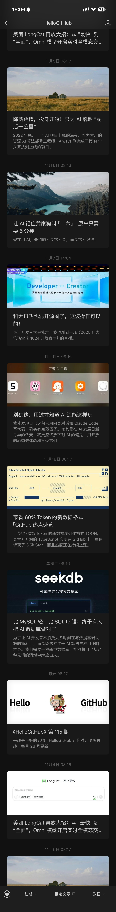

# 垂直长图图像拼接工具

[](https://python.org)
[](LICENSE)
[](https://opencv.org)
[](https://github.com/ktovoz/image-stitching/actions)
[](https://www.python.org/dev/peps/pep-0008/)

一个功能强大的Python垂直长图拼接工具集，提供三个专业工具用于不同的拼接需求，从简单的垂直拼接到高级的特征点对齐。

## 主要特性

- **智能特征检测**：使用AKAZE和SIFT算法进行精确的关键点匹配
- **自动顺序检测**：智能分析确定最佳图像序列
- **智能裁剪**：自动去除重复内容，最小化输出文件大小
- **详细可视化**：生成全面的匹配分析和调试图像
- **多格式支持**：支持JPG、JPEG、PNG、BMP格式
- **高性能**：优化算法，支持参数配置
- **灵活配置**：为专业用户提供广泛的定制选项

## 安装说明

### 系统要求

- Python 3.7 或更高版本
- pip 包管理器

### 安装依赖

```bash
# 克隆仓库
git clone https://github.com/ktovoz/image-stitching.git
cd image-stitching

# 安装必需的包
pip install -r requirements.txt
```

### 依赖包说明

- `opencv-python >= 4.5.0` - 计算机视觉操作
- `numpy >= 1.19.0` - 数值计算
- `loguru >= 0.5.0` - 高级日志记录
- `matplotlib >= 3.3.0` - 可视化和绘图

## 快速开始

### 方式1：AKAZE拼接器（推荐新手使用）

简单的垂直拼接，自动对齐：

```bash
python akaze_stitcher.py 图片文件夹路径 输出路径 是否保存匹配图
```

**示例：**
```bash
python akaze_stitcher.py ./screenshots ./output true
```

### 方式2：SIFT拼接器（高级用户）

专业级拼接，详细配置选项：

```bash
python sift_stitcher.py
```

### 方式3：图像排序器（预处理）

自动分析和整理无序图像：

```bash
python image_sorter.py
# 按照交互式提示操作
```

## 📋 使用示例

### 基础垂直拼接

```python
from akaze_stitcher import main

# 简单拼接
result = main(
    image_folder="./screenshots",
    output_path="./output/final.jpg",
    save_matches=True
)
```

### 高级SIFT拼接

```python
from sift_stitcher import stitch_images_from_directory

# 自定义配置
order_mapping = {
    "截图1.jpg": 1,
    "截图2.jpg": 2,
    "截图3.jpg": 3
}

result = stitch_images_from_directory(
    "imgs",
    "output",
    order_mapping,
    save_matches=True
)
```

### 编程接口

```python
from stitcher_module import StandaloneImageStitcher

# 高级拼接，自定义顺序
stitcher = StandaloneImageStitcher(
    image_folder="./screenshots",
    output_path="./output/result.jpg",
    save_matches=True,
    custom_order={"img1.jpg": 1, "img2.jpg": 2}
)

final_image = stitcher.process_all()
```

## 拼接预览

以下是使用本工具集生成的拼接效果示例：



*上图展示了工具自动识别图像顺序、智能对齐特征点并进行无缝拼接的效果*

## 工具对比

| 特性 | AKAZE拼接器 | 图像排序器 | SIFT拼接器 |
|------|-------------|------------|------------|
| **算法** | AKAZE + BFMatcher | AKAZE分析 | SIFT + FLANN + RANSAC |
| **适用场景** | 快速垂直拼接 | 预处理分析 | 专业级拼接 |
| **速度** | 快速 | 中等 | 慢速 |
| **精度** | 高 | 分析用途 | 最高 |
| **可视化** | 基础匹配图 | 全流程 | 高级调试 |
| **配置性** | 有限 | 分析重点 | 广泛 |
| **最适合** | 日常使用 | 无序图片集 | 专业结果 |

## 项目结构

```
image-stitching/
├── README.md                    # 本文件
├── requirements.txt             # Python依赖
├── akaze_stitcher.py           # AKAZE拼接工具
├── sift_stitcher.py            # SIFT拼接工具
├── image_sorter.py             # 图像分析工具
├── stitcher_module/            # 核心库
│   ├── __init__.py
│   ├── stitcher.py            # 主拼接引擎
│   ├── feature_matcher.py     # 特征检测与匹配
│   ├── image_cropper.py       # 智能裁剪逻辑
│   ├── common_utils.py        # 共享工具函数
│   ├── output_manager.py      # 文件与目录管理
│   └── config.py              # 配置常量
└── imgs/                      # 示例图片（可选）
    ├── img1.jpg
    ├── img2.jpg
    └── img3.jpg
```

## 配置选项

### SIFT拼接器配置

```python
from sift_stitcher import StitchingConfig

config = StitchingConfig(
    sift_nfeatures=2000,           # SIFT特征点数量
    ransac_threshold=3.0,          # RANSAC阈值
    fusion_height_ratio=0.4,       # 融合重叠比例
    gaussian_kernel_size=(3, 3),    # 预处理模糊核大小
    ratio_test_threshold=0.7       # 特征匹配阈值
)
```

### 输出结构

```
output/
├── stitched_image.jpg          # 最终结果
├── matches/                    # 匹配可视化
│   ├── match_01_02.jpg        # 图像1与2的匹配
│   ├── match_02_03.jpg        # 图像2与3的匹配
│   └── ...
└── stitching_info.json         # 详细拼接报告
```

## 最佳实践

### 获得最佳结果的建议

1. **重叠区域**：确保连续图像之间有20-40%的重叠
2. **图像质量**：使用光照良好、质量高的图像
3. **一致性**：保持相似的相机角度和位置
4. **分辨率**：使用具有足够分辨率的图像进行特征检测

### 性能优化技巧

- 对于大图像，减少`sift_nfeatures`以提高处理速度
- 减小`gaussian_kernel_size`以获得更锐利的特征
- 根据图像质量调整`ransac_threshold`
- 对光照困难的图像使用预处理

## 故障排除

### 常见问题

**问题：检测到的特征点不足**
```bash
解决方案：
- 检查图像质量和分辨率
- 确保有足够的重叠（20-40%）
- 降低`sift_contrast_threshold`
```

**问题：单应性矩阵计算失败**
```bash
解决方案：
- 验证图像有足够的匹配特征
- 增加`min_matches_for_ransac`
- 检查相机角度一致性
```

**问题：大图像导致内存错误**
```bash
解决方案：
- 处理前降低图像分辨率
- 减少`sift_nfeatures`数量
- 分批处理图像
```

**问题：拼接结果不佳**
```bash:
解决方案：
- 使用image_sorter.py验证正确顺序
- 检查重叠区域是否足够
- 调整RANSAC和匹配阈值
```

## API参考

### StandaloneImageStitcher 类

主要的图像拼接引擎，提供完整的拼接功能。

```python
class StandaloneImageStitcher:
    """独立图像拼接器，支持自动分析和智能拼接"""

    def __init__(self,
                 image_folder: str,
                 output_path: str = "final_stitched.jpg",
                 save_matches: bool = False,
                 custom_order: Optional[Dict[str, int]] = None):
        """
        初始化拼接器

        参数:
            image_folder: 图像文件夹路径
            output_path: 输出文件路径
            save_matches: 是否保存匹配可视化图
            custom_order: 自定义图像顺序映射 {filename: position}
        """

    def load_images(self) -> None:
        """加载图像文件夹中的所有有效图像"""

    def sort_images(self) -> None:
        """根据文件名或自定义顺序对图像进行排序"""

    def analyze_adjacent_pairs(self,
                               sorted_images: List[np.ndarray],
                               sorted_names: List[str]) -> Dict:
        """
        分析相邻图像对的特征匹配关系

        返回:
            Dict: 包含匹配信息的字典 {(idx1, idx2): (matches, positions, order, homography)}
        """

    def process_all(self) -> Optional[np.ndarray]:
        """
        执行完整的拼接流程

        返回:
            Optional[np.ndarray]: 拼接后的图像，失败时返回None
        """

    def get_sorted_images(self) -> List[np.ndarray]:
        """获取排序后的图像列表"""

    def get_sorted_names(self) -> List[str]:
        """获取排序后的文件名列表"""
```

### CompleteDebugStitcher 类

高级SIFT拼接器，提供详细的调试和可视化功能。

```python
class CompleteDebugStitcher:
    """完整的调试拼接器，支持详细的特征分析和可视化"""

    def __init__(self, config: Optional[StitchingConfig] = None):
        """
        初始化调试拼接器

        参数:
            config: 拼接配置对象，默认使用StitchingConfig()
        """

    def load_images(self, image_paths: List[str]) -> None:
        """
        从路径列表加载图像

        参数:
            image_paths: 图像文件路径列表
        """

    def stitch_with_median_anchor(self) -> Optional[Dict]:
        """
        使用中位数锚点方法进行拼接

        返回:
            Optional[Dict]: 包含拼接结果和详细信息的字典
        """

    def visualize_feature_matches(self,
                                  img1: np.ndarray,
                                  img2: np.ndarray,
                                  save_path: str,
                                  img1_position: str = 'top') -> int:
        """
        可视化两张图像之间的特征匹配

        参数:
            img1: 第一张图像
            img2: 第二张图像
            save_path: 保存路径
            img1_position: img1相对于img2的位置 ('top' 或 'bottom')

        返回:
            int: 匹配点数量
        """

    @property
    def images(self) -> List[np.ndarray]:
        """获取已加载的图像列表"""

    @property
    def image_paths(self) -> List[str]:
        """获取已加载的图像路径列表"""
```

### StitchingConfig 类

SIFT拼接器的配置参数类。

```python
@dataclass
class StitchingConfig:
    """SIFT拼接器配置参数"""

    # SIFT特征检测参数
    sift_nfeatures: int = 2000                    # SIFT特征点数量
    sift_contrast_threshold: float = 0.015        # 对比度阈值
    sift_edge_threshold: int = 20                 # 边缘阈值

    # FLANN匹配参数
    flann_index_kdtree: int = 1                   # KD树索引算法
    flann_trees: int = 4                          # KD树数量
    flann_search_checks: int = 32                 # 搜索检查次数

    # RANSAC过滤参数
    ransac_threshold: float = 3.0                 # RANSAC阈值
    ransac_max_iters: int = 50                    # 最大迭代次数
    ratio_test_threshold: float = 0.7             # 比率测试阈值
    min_matches_for_ransac: int = 4               # RANSAC最小匹配数

    # 图像处理参数
    gaussian_kernel_size: Tuple[int, int] = (3, 3) # 高斯模糊核大小
    gaussian_sigma: float = 0.6                   # 高斯模糊标准差

    # 质量评估参数
    x_quality_normalizer: float = 30.0            # X方向质量归一化
    match_density_normalizer: int = 10            # 匹配密度归一化
    distribution_quality_divisor: float = 1.0      # 分布质量除数

    # 融合参数
    fusion_height_ratio: float = 0.4              # 融合高度比例
    max_fusion_height: int = 300                   # 最大融合高度
    min_fusion_height: int = 80                   # 最小融合高度

    # 可视化参数
    viz_max_width: int = 800                      # 可视化最大宽度
    viz_max_height: int = 600                     # 可视化最大高度
    viz_match_radius: int = 5                     # 匹配点显示半径
    viz_matches_to_show: int = 150                # 显示的匹配数量

    # 验证参数
    min_features_for_validation: int = 5          # 验证最小特征数
    min_matches_for_matching: int = 5             # 匹配最小匹配数
```

### 核心函数接口

```python
def main(image_folder: str,
         output_path: str = "final_stitched.jpg",
         save_matches: bool = False,
         order_file: str = None) -> Optional[np.ndarray]:
    """
    AKAZE拼接器主函数

    参数:
        image_folder: 图像文件夹路径
        output_path: 输出文件路径
        save_matches: 是否保存匹配可视化图
        order_file: 自定义顺序JSON文件路径

    返回:
        Optional[np.ndarray]: 拼接后的图像
    """

def stitch_images_from_directory(image_dir: str,
                                 output_dir: str = "output",
                                 order_mapping: dict = None,
                                 save_matches: bool = True) -> Optional[str]:
    """
    SIFT拼接器主函数

    参数:
        image_dir: 图像目录路径
        output_dir: 输出目录路径
        order_mapping: 自定义顺序映射
        save_matches: 是否保存匹配图

    返回:
        Optional[str]: 最终拼接图像路径，失败返回None
    """
```

### 使用示例

```python
# 基础AKAZE拼接
from akaze_stitcher import main
result = main("./images", "./output/final.jpg", save_matches=True)

# 高级SIFT拼接
from sift_stitcher import stitch_images_from_directory, StitchingConfig

config = StitchingConfig(
    sift_nfeatures=1500,
    ransac_threshold=2.5,
    fusion_height_ratio=0.5
)

result = stitch_images_from_directory(
    image_dir="./screenshots",
    output_dir="./panorama",
    save_matches=True
)

# 编程接口使用
from stitcher_module import StandaloneImageStitcher

custom_order = {
    "screen1.jpg": 1,
    "screen2.jpg": 2,
    "screen3.jpg": 3
}

stitcher = StandaloneImageStitcher(
    image_folder="./images",
    output_path="./result.jpg",
    save_matches=True,
    custom_order=custom_order
)

final_image = stitcher.process_all()
if final_image is not None:
    print(f"拼接成功！最终图像尺寸: {final_image.shape}")
else:
    print("拼接失败，请检查图像质量和重叠区域")
```

## 贡献

欢迎贡献！请按照以下步骤开始：

1. **Fork** 本仓库
2. **创建** 功能分支：`git checkout -b 功能名称`
3. **提交** 更改：`git commit -m "添加功能描述"`
4. **推送** 到分支：`git push origin 功能名称`
5. **创建** Pull Request

### 开发环境设置

```bash
# 克隆你的fork
git clone https://github.com/ktovoz/image-stitching.git
cd image-stitching

# 创建虚拟环境
python -m venv venv
source venv/bin/activate  # Windows: venv\Scripts\activate

# 开发模式安装
pip install -e .

# 运行测试（如果有）
python -m pytest tests/
```

## 更新日志

### v1.0.0 (2025-11-28)

- 首次发布
- 三个专业拼接工具
- 全面的可视化功能
- 广泛的配置选项
- 完整的API文档

## 许可证

本项目采用MIT许可证 - 详见 [LICENSE](LICENSE) 文件。

---

<div align="center">
  <strong>如果这个项目对你有帮助，请给它一个星标！</strong>
</div>